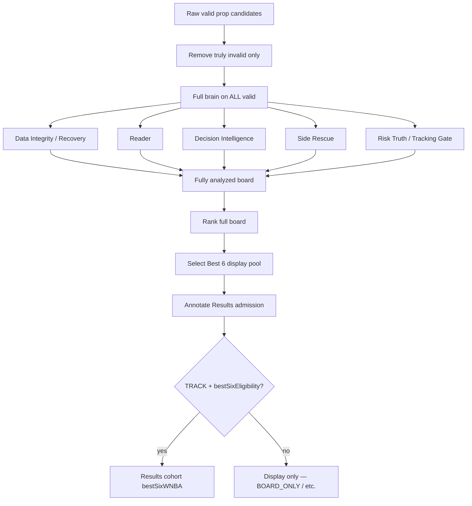

# CourtEdge Controlled Best 6 — Full Brain Pipeline Fix

**Date:** 2026-06-26  
**Branch:** `betbrain-v2-rebuild`  
**Prior SERVER_BUILD:** `courteedge-best-six-display-v1` (e9ba18b)  
**SERVER_BUILD:** `courteedge-best-six-full-brain-v1`  
**Selector version:** `controlled-best-six-full-brain-v1`

## Problem

User observed on 6/26 WNBA slate:

| Metric | Value |
|--------|-------|
| Controlled Best 6 | **1/6** |
| Board Candidates | 15 |
| Board Only | 10 |
| No Bet | 3 |

With 15 valid candidates, Controlled Best 6 should show up to 6 ranked props after full brain analysis — even when only 1 is TRACK for Results.

## Root Cause

`selectBestSixDisplay()` in `controlledBestSixSelector.js` called `filterDisplayCandidates()`, which applied `passesDisplayEligibility()` **before** ranking and Best 6 selection. This dropped all `BOARD_ONLY` and `NO_BET` picks from the display pool, so only TRACK-eligible candidates could appear in Best 6 UI.

`selectControlledBestSix()` (Results / tracking cohort) correctly filters TRACK-only **after** analysis — that path was unchanged.

## Fix

1. Replaced `filterDisplayCandidates` with `filterAndAnalyzeCandidates`:
   - Base validity only (started, missing fields, hard no-play)
   - Full WNBA decision stack (DI + Side Rescue + Risk Truth) on every valid candidate
   - Dedupe only
   - **No** display-eligibility or TRACK pre-filter

2. `selectBestSixDisplay` now:
   - Analyzes full pool → scores → ranks → selects top 6 with diversity caps
   - Annotates `resultsAdmissionEligible` **after** selection via `annotateResultsAdmission()`

3. `selectControlledBestSix` unchanged: TRACK + `bestSixEligibility` gate for Results cohort only.

4. Frontend (`explore.tsx`, `utils/controlledBestSixDisplay.js`) already consumed `bestSixDisplayWNBA` without pre-filtering — no frontend change required.

## Pipeline Order (After Fix)



## Before vs After Flow

### Before (bug)

```
15 candidates
  → filterDisplayCandidates (drops BOARD_ONLY + NO_BET)  ← BUG
  → ~1 TRACK survives
  → rank + select Best 6
  → Controlled Best 6: 1/6
```

### After (fixed)

```
15 candidates
  → filterAndAnalyzeCandidates (full brain, no eligibility cut)
  → 15 analyzed (minus true invalid / dupes)
  → rank + select top 6
  → annotate Results admission
  → Controlled Best 6: 6/6 (1 TRACK official + 5 non-TRACK display)
  → Results Track: 1/6
```

## 6/26 Board Counts (simulated acceptance pool)

Fixture: 15 WNBA candidates (1 TRACK + 14 BOARD_ONLY), matching prod eligibility split:

| Metric | Before | After |
|--------|--------|-------|
| Candidates analyzed | 1 | 15 |
| Controlled Best 6 | 1/6 | **6/6** |
| Results Track | 1/6 | 1/6 |
| BOARD_ONLY in Best 6 display | 0 | 5 |
| All 6 have DI + Risk Truth | partial | **yes** |
| All 6 have Side Rescue | partial | **yes** |

## Files Changed

| File | Change |
|------|--------|
| `engines/topProps/controlledBestSixSelector.js` | `filterAndAnalyzeCandidates`; remove display pre-filter; version bump |
| `server.js` | `SERVER_BUILD` → `courteedge-best-six-full-brain-v1` |
| `scripts/testControlledBestSix.js` | Pipeline order tests 30–31 |
| `scripts/testControlledBestSixDisplay.js` | Acceptance test 32 (15 → 6 display) |

## Tests

```
node betbrain-server/scripts/testControlledBestSix.js      → 31/31 passed
node betbrain-server/scripts/testControlledBestSixDisplay.js → 32/32 passed
```

Key assertions:

- 15 candidates → all run through DI + Side Rescue + Risk Truth
- `selectBestSixDisplay` returns 6 from full analyzed board
- `selectControlledBestSix` remains TRACK-only for Results
- Display Best 6 includes `resultsAdmissionEligible: false` picks
- Summary counts reconcile (board candidates = track + boardOnly + noBet + …)

## Intentionally Unchanged

- Results admission: TRACK + `bestSixEligibility` only
- No gate lowering to force TRACK
- No `/clear-tracked-props`
- No runtime JSON commits

---

## Display Rank Gap Fix (2026-06-26 follow-up)

**SERVER_BUILD:** `courteedge-best-six-display-fix-v1`  
**Selector:** `controlled-best-six-display-fix-v1`

### Symptom (6/26 prod snapshot)

Summary: Controlled Best 6 **3/6**, Results Track **1/6**, Board Candidates **16**.

Rendered rows showed **Best #2, #4, #5** only. TRACK prop (Results 1/6) missing from Controlled Best 6 list.

### Root cause

Client-side in `utils/controlledBestSixDisplay.js` + `explore.tsx`:

1. `filterBestSixByDateView` on Best 6 display removed non-matching day buckets (tomorrow picks at ranks 1, 3, 6).
2. `enrichBestSixForDisplay` kept server ranks after filter → gaps (#2, #4, #5).

PropCard did not hide eligibility types; rows were filtered before render.

### Fix

- `prepareBestSixDisplayCards()` — full slate pool, contiguous ranks 1..N
- Summary `controlledBestSixTotal` uses full pool; date tab scopes board candidates only
- `bestSixHiddenByDateView` diagnostic when tabs would have hidden rows

### Before / after (6/26 scenario)

| Metric | Before | After |
|--------|--------|-------|
| Rendered rows (Today tab) | 3 at ranks 2,4,5 | 6 at ranks 1-6 |
| TRACK in display | hidden | visible |
| Controlled Best 6 summary | 3/6 | 6/6 |
| Results Track | 1/6 | 1/6 |
