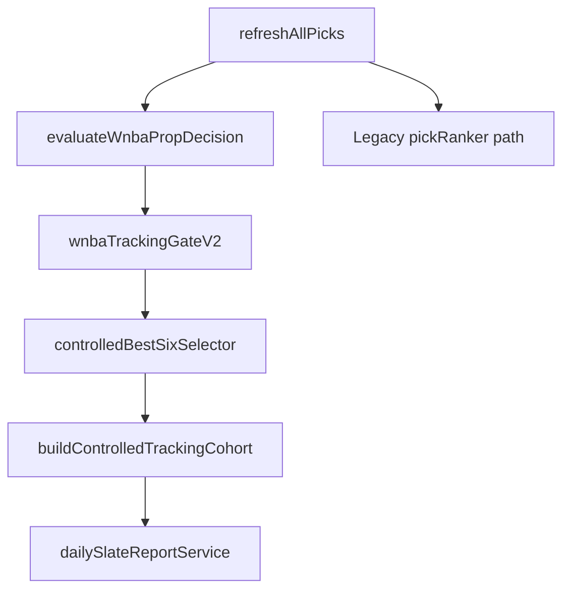

# CourtEdge Decision Intelligence Report (Pre-v1 Inspection)

**Inspection date:** 2026-06-25  
**Prior SERVER_BUILD:** `courteedge-wnba-tracking-gate-v2-live`  
**Successor build:** `courteedge-decision-intelligence-v1`

## Executive Summary

Before Decision Intelligence v1, CourtEdge used a **three-layer admission model**: (1) full candidate pool generation (WNBA v2 stack or NBA legacy), (2) WNBA Tracking Gate v2 eligibility (TRACK/BOARD_ONLY/SHADOW_ONLY/NO_BET), (3) Controlled Best 6 → Results. Top Picks were reference-only labels, not admission drivers.

Decision Intelligence v1 adds a **unified parent brain** on top of gate v2 without replacing it.

## Architecture (Pre-v1)

## Key Versions (Pre-v1)

| Constant | Value |
|----------|-------|
| SERVER_BUILD | courteedge-wnba-tracking-gate-v2-live |
| WNBA_TRACKING_GATE_VERSION | wnba-tracking-gate-v2-live |
| CONTROLLED_BEST_SIX_VERSION | controlled-best-six-v2-fix |
| TOP_PROP_SELECTOR_VERSION | top-prop-selector-v3-league-split |

## Known Gaps (Addressed in v1)

1. Multiple separate "little brains" — **fixed** with `propDecisionIntelligenceV1.js`
2. Risk labels did not control behavior — **fixed** with trueRisk + eligibility flags
3. Board "Playable" was confusing — **fixed** with Trackable/Board Only/No Bet counts
4. Retro simulation hardcoded to 06/24 — **fixed** for any graded slate
5. NBA has no tracking gate — **stubbed** with passthrough structures

## File Map

See `COURTEDGE_DECISION_INTELLIGENCE_V1_REPORT.md` for v1 changes.

Full pre-v1 inspection covered: `wnbaDecisionEngine.js`, `wnbaTrackingGateV2.js`, `controlledBestSixSelector.js`, `trackedPropService.js`, `dailySlateReportService.js`, `explore.tsx`, `prop-lab.tsx`, `PropCard.tsx`, and associated test suites.
