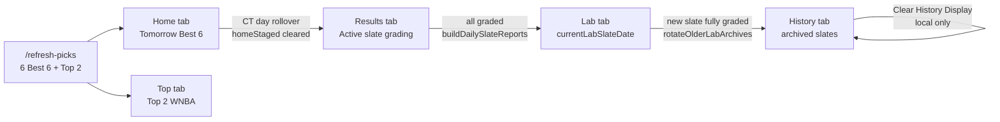
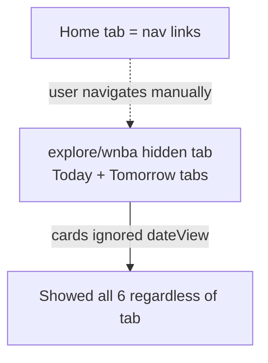

# CourtEdge Prop Rotation Flow Report

**Branch:** `betbrain-v2-rebuild`  
**Date:** 2026-07-08  
**SERVER_BUILD:** `courteedge-history-rebuild-v1`

---

## Update: History tab erase + rebuild (2026-07-08)

### Problem

Prod Lab stuck on `currentLabSlateDate: "2026-06-21"` while History showed **0 slates** — corrupted `history-archive/*` + `locked-slates.json` ARCHIVED/LAB registry rows out of sync with `computeSlateRotation`. Rotation blocked; 07/07 Results cohort at risk of being obscured.

### Fix

| Area | Change |
|------|--------|
| `resetHistoryArchivesService.js` | Backup → clear history-archive files + ARCHIVED/LAB registry rows → rebuild ARCHIVED slates from snapshots → archive stuck 06/21 → lab rotation repair |
| `slateLockService.js` | `clearHistoryArchiveFiles`, `resetHistoryRegistryEntries`, `deleteHistoryArchive` |
| `scripts/resetHistoryArchives.js` | Render-shell runner (no `ADMIN_SECRET`) |
| `server.js` | `POST /admin/reset-history`; `SERVER_BUILD=courteedge-history-rebuild-v1`; startup hook `COURTEDGE_HISTORY_REBUILD_V1` |
| `app/(tabs)/history.tsx` | Loads from `historySlateDates` + archives; **Reset Server History** button |
| `utils/historyArchive.ts` | ARCHIVED-phase only for archive-backed entries; filter by server `historySlateDates` |
| `services/api.ts` | `resetHistoryArchives()` |
| `testSlateRotationLifecycle.js` | Tests 28–30: LAB vs ARCHIVED history eligibility, 07/07 Results preserved in rotation |

### Prod repair

```bash
# Dry run (Render shell)
cd betbrain-server
node scripts/resetHistoryArchives.js --dry-run

# Apply (creates backup first)
node scripts/resetHistoryArchives.js
```

Or with admin secret:

```bash
curl -X POST "$API/admin/reset-history" \
  -H "x-admin-secret: $SECRET" \
  -H "Content-Type: application/json" \
  -d '{"dryRun": true}'

curl -X POST "$API/admin/reset-history" \
  -H "x-admin-secret: $SECRET" \
  -H "Content-Type: application/json" \
  -d '{"confirm": true}'
```

Or set `COURTEDGE_HISTORY_REBUILD_V1=true` in Render env (replaces `COURTEDGE_ARCHIVE_LAB_0621_V1`) and redeploy.

**Does NOT** call `/clear-tracked-props`. ACTIVE Results registry rows and tracked props for 07/07 are preserved.

### Live re-inspect (2026-07-08 ~03:35 CT) — repair NOT applied

| Field | Prod now | Healthy target |
|-------|----------|----------------|
| `serverBuild` | `courteedge-history-rebuild-v1` | same (code shipped) |
| `currentLabSlateDate` | `2026-06-21` | `null` or newer graded slate |
| `historySlateDates` | `[]` | includes `2026-06-21` once phase ARCHIVED |
| `activeResultsSlateDate` | `null` | 07/07 or 07/08 when Results cohort exists |
| `/history-archives` 06/21 | **phase LAB**, 14 props, `archivedAt` 08:29:22Z | phase **ARCHIVED** |
| Tracked by slate | 06/14:11, 06/15:8 (quarantined), 06/21:14 | + active Results cohort |
| 07/07 tracked | **0** | expected if Results slate was tracked |
| `lastBackup` | `2026-07-08T08-29-22Z` **`pre-lab-restore-2026-06-21`** | should be `pre-history-archives-reset-v1` or similar |

**Verdict: FAIL — will-not-stuck-again not confirmed.** Build is deployed, but data is still stuck Lab. Last backup reason shows a **lab restore** re-wrote 06/21 as `phase: LAB` after (or instead of) History rebuild.

**Recurrence prevention that works once 06/21 is ARCHIVED:**

1. `getArchivedHistoryDates` only counts `phase === "ARCHIVED"` → Lab stops selecting 06/21.
2. `rotateStaleLabArchives` (on every report build) archives any LAB bundle that is **not** `currentLabSlateDate`.
3. `promoteSlateToLab` requires final report + no unresolved grades — no auto-promote without grading.
4. Empty Lab does **not** block Results → Lab; Results is independent (`activeResultsSlateDate`).
5. `prop-lab.tsx` only displays server `currentLabSlateDate` (no local picker that can re-stick).

**Remaining holes:**

- `restoreCompletedLabSlate` / `POST /admin/restore-official-slate` `mode: "lab"` always writes **LAB** phase — **can re-stick** (observed tonight).
- `COURTEDGE_HISTORY_REBUILD_V1=true` in `render.yaml` only helps on startup; a later lab restore undoes it. Leaving the flag permanently true also re-wipes History archives every boot.
- `rotateStaleLabArchives` will **not** self-archive the current Lab slate — a lone graded LAB slate with no newer Lab candidate stays stuck until repair or a newer final slate promotes+.

**Action (Render shell):**

```bash
cd betbrain-server
node scripts/resetHistoryArchives.js --dry-run
node scripts/resetHistoryArchives.js
```

Then **do not** re-run lab restore for 06/21. After healthy verify, set `COURTEDGE_HISTORY_REBUILD_V1=false` (or remove) so boots do not keep erasing History.

---

## Update: Home tab NBA / WNBA switcher (2026-07-06)

| Area | Change |
|------|--------|
| `components/HomeControlledBestSixScreen.tsx` | Home tab now uses NBA \| WNBA segmented tabs instead of stacked sections; single `fetchSavedPicks` / `refreshSavedPicks` still loads both leagues; copy report unchanged (both leagues) |

Rotation flow unchanged — Tomorrow-only view, Top 2 → Top tab, all 6 → Results.

---

## Update: Archive stuck Lab 06/21 without replacement (2026-06-28)

### Problem

Prod Lab remained pinned to `currentLabSlateDate: "2026-06-21"` with a LAB-phase archive bundle. The 06/28 promotion path was not desired for this repair.

### Fix

| Area | Change |
|------|--------|
| `archiveLabSlate0621Service.js` | Targeted repair — archives 06/21 when it is current Lab; no 06/28 merge |
| `scripts/archiveLabSlate0621.js` | Render-shell runner (backup + `archiveSlate`) |
| `server.js` | `POST /admin/archive-lab-slate-0621` (`dryRun` + `confirm`) |
| `testSlateRotationLifecycle.js` | Test 27: archive-without-replacement → empty Lab |

### Prod repair

```bash
# Dry run
curl -X POST "$API/admin/archive-lab-slate-0621" \
  -H "x-admin-secret: $SECRET" \
  -H "Content-Type: application/json" \
  -d '{"dryRun": true}'

# Apply (creates backup first)
curl -X POST "$API/admin/archive-lab-slate-0621" \
  -H "x-admin-secret: $SECRET" \
  -H "Content-Type: application/json" \
  -d '{"confirm": true}'
```

Or on Render shell: `node scripts/archiveLabSlate0621.js` (add `--dry-run` first).

Does **not** call `/clear-tracked-props` or `promoteLabSlate0628Archive0621`.

**Commits:** `42f17c0` (service + endpoint), `07b430e` (Render startup hook `COURTEDGE_ARCHIVE_LAB_0621_V1`).

**Prod before (2026-06-29):** `serverBuild=courteedge-promote-lab-0628-v1`, `currentLabSlateDate=2026-06-21`, `historySlateDates=[]`. `ADMIN_SECRET` not configured on Render (admin endpoint returns 503).

**Prod apply:** Render shell `node scripts/archiveLabSlate0621.js` (or set `COURTEDGE_ARCHIVE_LAB_0621_V1=true` in Render env and redeploy). Startup hook added in `07b430e` via `render.yaml` for automatic one-time run on next blueprint sync/deploy.

---

## Update: Lab shows only current slate (2026-06-28)

### Root cause

1. **Client:** `prop-lab.tsx` rendered a slate picker from **all** `validCompletedReports`, so older finals (06/21, 06/24, 06/27) stayed selectable in Lab even after rotation classified them as History.
2. **Server:** `rotateOlderLabArchives` archived by “second-newest final report” only; it ignored `computeSlateRotation` and failed when registry entries were missing. LAB-phase archives could remain visible to Lab prop loading.

### Fix

| Area | Change |
|------|--------|
| `app/(tabs)/prop-lab.tsx` | Lab binds to `currentLabSlateDate` only; no multi-slate picker; props load from non-ARCHIVED archive for current Lab slate |
| `dailySlateReportService.js` | `getStaleLabArchiveCandidates` + `rotateStaleLabArchives` (rotation-aware); called on every report build |
| `slateLockService.js` | `archiveSlate` works when archive exists but registry entry is missing |
| `repairLabSlateRotationService.js` | Safe prod repair — archives stale LAB bundles, optional rebuild; **does not** clear tracked props |
| `server.js` | `POST /admin/repair-lab-slate-rotation` |

### Prod repair (if old LAB slates still visible)

```bash
# Dry run
curl -X POST "$API/admin/repair-lab-slate-rotation" \
  -H "x-admin-secret: $SECRET" \
  -H "Content-Type: application/json" \
  -d '{"dryRun": true}'

# Apply (creates backup first)
curl -X POST "$API/admin/repair-lab-slate-rotation" \
  -H "x-admin-secret: $SECRET" \
  -H "Content-Type: application/json" \
  -d '{"confirm": true}'
```

Then refresh Prop Lab in the app (pull-to-refresh runs resolve + report build).

### Before / After Lab behavior

| Before | After |
|--------|-------|
| Picker listed every completed daily report | Single chip: current Lab slate only |
| Selecting 06/21 loaded archived props in Lab | Lab props/reports only for `currentLabSlateDate` |
| Stale LAB-phase archives could persist | Build + repair archive them to History (`phase: ARCHIVED`) |

Today's data is preserved: repair only changes archive `phase` and registry metadata; tracked props, snapshots, and reports are not deleted.

---

**Prior update date:** 2026-06-26  
**Prior SERVER_BUILD:** `courteedge-best-six-display-fix-v1`  

---

## Update: NBA + WNBA Separation (post fa212a1)

### How leagues were separated before

| Era | Home | NBA | WNBA |
|-----|------|-----|------|
| **Original (07f7a9d)** | Nav hub with separate **NBA Props** (`/nba`) and **WNBA Props** (`/wnba`) buttons | Full game board + Top props by day bucket (Today/Tomorrow) | Hidden explore route |
| **WNBA v2 (92e364a–fa212a1)** | WNBA-only Tomorrow Best 6 | Old board unchanged on `/nba` | Controlled Best 6 on explore |
| **Now** | **Dual-league Tomorrow Best 6** (WNBA + NBA sections) | Controlled Best 6 explore (`/nba`) | Controlled Best 6 explore (`/wnba`, `/explore`) |

Server already ran **parallel paths** via `selectControlledBestSixCombined`:
- `bestSixWNBA` / `bestSixDisplayWNBA` / `topWNBAProps`
- `bestSixNBA` / `bestSixDisplayNBA` / `topNBAProps`
- Shared slate rotation (date-based, not league-split) — both leagues on same slate date rotate together in Results/Lab/History

### Before / After UX

**Before (fa212a1):** Home showed WNBA Tomorrow Best 6 only; NBA still used legacy game-board screen without Controlled Best 6 display pool.

**After:** Home shows **two stacked sections** — WNBA Tomorrow Best 6 (pink) and NBA Tomorrow Best 6 (blue). Top tab already had separate NBA/WNBA blocks. `/nba` and `/wnba` routes use identical Controlled Best 6 explore screens with league-specific theming. Same rotation: Tomorrow Home → Results → Lab → History (user reset only).

### League-split files (this pass)

| File | Change |
|------|--------|
| `utils/controlledBestSixDisplay.js` | League-agnostic helpers: `buildLeagueBestSixBoard`, `resolveLeaguePicksPayload`, `buildLeagueControlledSummary`, `buildHomeControlledBestSixReportText` |
| `components/LeagueControlledBestSixScreen.tsx` | **New** — single-league explore/home screen |
| `components/HomeControlledBestSixScreen.tsx` | **New** — dual-league Tomorrow Home |
| `components/leagueBestSixTheme.ts` | **New** — NBA blue / WNBA pink themes |
| `app/(tabs)/index.tsx` | Uses `HomeControlledBestSixScreen` |
| `app/(tabs)/nba.tsx` | Controlled Best 6 explore (NBA) |
| `app/(tabs)/wnba.tsx` | Controlled Best 6 explore (WNBA) |
| `utils/reportBuilders.ts` | `buildLeagueControlledBestSixReport` |
| `betbrain-server/scripts/testControlledBestSixDisplay.js` | +tests 38–40 (NBA + home report) |

### Gaps

- **Rotation is slate-date scoped, not per-league:** When one league's 6 grade before the other on the same date, Lab promotion waits for full slate completion (existing server behavior).
- **NBA decision intelligence:** Uses same `propDecisionIntelligenceV1` pipeline as WNBA via controlled selector; WNBA-specific gate fields (`wnbaTrackingDecision`) fall back gracefully for NBA.
- **No SERVER_BUILD bump:** Client-only + shared util changes; server payloads already exposed NBA display fields.

---

## Executive Summary

CourtEdge already had a **server-side slate rotation engine** (`computeSlateRotation`, lifecycle classification, Lab promotion, History archival). The main gaps were **client UX**: Home was a navigation hub (not the Best 6 board), Best 6 cards ignored Today/Tomorrow date tabs, and History auto-expired after 7 days instead of staying until user reset.

This pass wires **Home → Tomorrow Best 6 only**, fixes **date-scoped Best 6 display**, and sets **History retention to user-reset-only**. Server rotation logic was verified and extended with one additional lifecycle test; no server code changes required.

---

## Desired Flow vs Current (After Fix)

| Step | Desired | Before | After |
|------|---------|--------|-------|
| 1. Generation | 6 props through full intelligence | ✅ `/refresh-picks` → controlled cohort + tracking | ✅ Unchanged |
| 2. Home | Tomorrow section only | ❌ Home was link dashboard; Best 6 on hidden explore tab with Today/Tomorrow tabs | ✅ Home tab shows **Tomorrow Best 6 only** |
| 3. Top tab | Top 2 from Best 6 | ✅ `selectControlledBestSix` → top 2 WNBA on refresh | ✅ Unchanged |
| 4. Day rollover | Tomorrow → Results | ✅ `homeStaged` on future slate; CT midnight clears `homeStaged` on auto-lock | ✅ Unchanged |
| 5. Grading → Lab | All 6 graded → Lab | ✅ `buildDailySlateReportsFromTrackedProps` → `promoteSlateToLab` + rotation inference | ✅ Unchanged |
| 6. Lab retention | Until next rotation | ✅ Newest completed = Lab; older in `historySlates` | ✅ Unchanged |
| 7. History | Prior Lab when new batch graded | ✅ `rotateOlderLabArchives` on report build | ✅ Unchanged |
| 8. History retention | Until user reset | ⚠️ 7-day auto-hide | ✅ **User Clear only** (`HISTORY_RETENTION_DAYS = 0`) |
| 9. Smooth rotation | End-to-end | ⚠️ UI date filter didn't scope cards | ✅ Date filter applied to cards + summary |

---

## Flow Diagrams

### Desired / Implemented Rotation



### Before (Home UX gap)



---

## Files Inspected

### Client — Tabs

| File | Role |
|------|------|
| `app/(tabs)/index.tsx` | Home tab (was nav hub) |
| `app/(tabs)/explore.tsx` | WNBA Controlled Best 6 (hidden route) |
| `app/(tabs)/top-props.tsx` | Top 2 NBA + WNBA |
| `app/(tabs)/results.tsx` | Active Results grading queue |
| `app/(tabs)/prop-lab.tsx` | Current Lab slate analytics |
| `app/(tabs)/history.tsx` | Archived slates + saved picks |
| `app/(tabs)/_layout.tsx` | Tab bar (Home, Top, Results, Lab, History) |

### Client — Utils

| File | Role |
|------|------|
| `utils/slateRotation.ts` | Client mirror of rotation (`computeSlateRotation`, `pickActiveResultsSlateDate`) |
| `utils/slateMessages.ts` | User-facing slate date messages |
| `utils/controlledBestSixDisplay.js` | Best 6 display helpers, date buckets |
| `utils/resultsQueue.ts` | Results visibility, active slate helpers |
| `utils/historyArchive.ts` | History entry builders |
| `utils/historyRetention.ts` | Local History clear + retention |
| `utils/groupByDayBucket.ts` | Today/Tomorrow game grouping |

### Server

| File | Role |
|------|------|
| `betbrain-server/services/slateScopeService.js` | Rotation source of truth |
| `betbrain-server/services/slateLifecycleService.js` | Per-prop lifecycle buckets (`HOME_STAGED`, `ACTIVE_RESULTS`, etc.) |
| `betbrain-server/services/trackedPropService.js` | Tracking admission, `homeStaged`, auto-lock |
| `betbrain-server/services/dailySlateReportService.js` | Report build, Lab promotion, `rotateOlderLabArchives` |
| `betbrain-server/services/slateLockService.js` | Lock/Lab/Archive phases |
| `betbrain-server/services/topPicksSnapshotService.js` | Top 2 snapshots |
| `betbrain-server/server.js` | `/picks`, `/tracked-props`, `/daily-slate-reports` |

### Tests / Scripts

| File | Role |
|------|------|
| `betbrain-server/scripts/testSlateRotationLifecycle.js` | Rotation unit tests (24 cases) |
| `betbrain-server/scripts/testControlledBestSixDisplay.js` | Display helper tests (37 cases) |
| `betbrain-server/scripts/testActiveResultsSlate.js` | Results admission |
| `betbrain-server/scripts/testTrackedPropsLifecycleFilter.js` | Lifecycle filter |

---

## How Rotation Works Today

### 1. Generation (`POST /refresh-picks`)

- Builds today + tomorrow game cards with `dayBucket` / `dateLabel`.
- `selectControlledBestSix` picks 6 WNBA (+ NBA) through decision intelligence.
- Top 2 WNBA from Best 6 → `topWNBAProps` + snapshot.
- TRACK-only cohort → `addTrackedProps` (future slate props get `homeStaged: true` when prior Results slate still open).

### 2. Home (Tomorrow board)

- Reads `/picks` cache (`bestSixDisplayWNBA`, `bestSixWNBA`, `topWNBAProps`).
- **Home tab** filters display pool to `dayBucket === TOMORROW` only.
- Does **not** show tracked props — board is pre-admission preview.

### 3. Top tab

- `/top-props` returns snapshotted top 2 per league from last refresh.

### 4. Day rollover → Results

- When slate date becomes today and official TRACK props exist:
  - `pickActiveResultsSlateDate` → today.
  - `autoLockResultsSlateIfReady` locks slate, clears `homeStaged` on today's props.
- `/tracked-props` default response = `activeResultsProps` only (TRACK official, not homeStaged).

### 5. Grading completion → Lab

- `POST /resolve-tracked-props` grades props.
- `buildDailySlateReportsFromTrackedProps`:
  - Final report → `promoteSlateToLab` + history archive (`phase: LAB`).
  - `rotateOlderLabArchives` → older finals get `phase: ARCHIVED`.
- Client `computeSlateRotation` also **infers** Lab from graded props when report is stale.

### 6. Lab tab

- Uses `currentLabSlateDate` from `/daily-slate-reports` rotation metadata.
- Shows report sections + tracked prop analytics for that slate.

### 7. History tab

- `buildHistoryEntries` + rotation `historySlates` / archives with `phase: ARCHIVED`.
- **Clear History Display** → AsyncStorage hide (backend unchanged).
- **No auto 7-day expiry** after this fix.

---

## Changes Made (This Pass)

| File | Change |
|------|--------|
| `components/WnbaControlledBestSixScreen.tsx` | **New** shared Home/Explore board; Home = Tomorrow-only |
| `app/(tabs)/index.tsx` | Home uses shared screen `variant="home"` |
| `app/(tabs)/explore.tsx` | Thin wrapper `variant="explore"` |
| `utils/controlledBestSixDisplay.js` | `HOME_DATE_VIEW`; date-scoped `controlledBestSixTotal`; card date filter support |
| `utils/historyRetention.ts` | `HISTORY_RETENTION_DAYS = 0` (no auto expiry) |
| `app/(tabs)/history.tsx` | Copy updated for user-reset-only retention |
| `betbrain-server/scripts/testSlateRotationLifecycle.js` | +test 24; header count |
| `betbrain-server/scripts/testControlledBestSixDisplay.js` | +tests 36–37; fix tests 14/34 for scoped totals |

---

## Remains Manual / TBD

| Item | Notes |
|------|-------|
| **Prod runtime repair** | If prod JSON still has stale reports / wrong archive phases, run repair scripts with `ADMIN_SECRET` (see `COURTEDGE_SLATE_ROTATION_FIX_REPORT.md`) |
| **`/refresh-picks` on schedule** | Tomorrow props appear on Home only after refresh generates them |
| **Scout / Full Board** | Hidden on Home; still on explore route (`/explore`, `/wnba`) |
| **NBA Best 6 on Home** | ~~Home is WNBA-only~~ **Fixed** — dual WNBA + NBA Tomorrow sections |
| **Saved picks in History** | User-saved picks still appear alongside archived Lab slates |

---

## Test Results

```
node betbrain-server/scripts/testSlateRotationLifecycle.js     → 24 passed, 0 failed
node betbrain-server/scripts/testControlledBestSixDisplay.js   → 40 passed, 0 failed
```

---

## Blockers

- **ADMIN_SECRET**: Required for prod repair endpoints; not needed for this client-only deploy.
- **Prod JSON state**: Code deploy alone does not rebuild stale daily reports or re-archive slates — use existing repair scripts if prod Lab/History is stuck.
- **No `/clear-tracked-props`**: Not run (per instructions).

---

## Home Tomorrow WNBA Count Bug Fix (2026-06-27)

**Symptom (Tomorrow Home WNBA):** Controlled Best 6 showed **4/6** rows despite 11 board candidates; Top Picks **1/2** while two cards showed Decision TRACK; summary **Track: 2** vs **Results Track: 1/6**.

### Root cause

Same class of bug as `d66331c`: `buildLeagueBestSixBoard` applied `filterBestSixByDateView` to the slate-level `bestSixDisplayWNBA` pool. The server selects six picks across Today+Tomorrow; Tomorrow-only filtering dropped non-TOMORROW slots → four rows.

Separate metrics were conflated in the UI:

| Metric | Source | Meaning |
|--------|--------|---------|
| **Best 6 X/6** | Date-scoped display pool (filled to 6) | Rendered card count |
| **Board Track** | All analyzed candidates in date bucket | Decision TRACK on board |
| **Results Track X/6** | `bestSixWNBA` Results pool, TRACK eligibility | Props admitted to Results cohort |
| **Top Picks X/2** | ~~Server top-2 from Results Best 6~~ **Fixed** — top 2 from display Best 6 ranking |

A prop can show Decision **TRACK** on its card (Side Rescue / display brain) while `resultsAdmissionEligible === false` — e.g. DeWanna Bonner BOARD_ONLY rescue — so Board Track (2) ≠ Results Track (1) is expected when one TRACK-labeled card is not Results-admitted.

### Fix

| File | Change |
|------|--------|
| `utils/controlledBestSixDisplay.js` | `resolveDateScopedDisplayPool` — keep in-bucket slate picks, fill to 6 from date-scoped `allGeneratedCandidates`; `isResultsPoolTrackProp`; summary uses `scopedDisplayPool`/`bestSixCards` for reconciled totals; `boardTrack` field; report labels **Board Track** vs **Results Track** |
| `components/HomeControlledBestSixScreen.tsx` | Summary row: **Board Track** metric |
| `components/LeagueControlledBestSixScreen.tsx` | Same **Board Track** label on explore |
| `betbrain-server/scripts/testControlledBestSixDisplay.js` | Tests 41–44 (tomorrow fill, Results vs display TRACK, top picks, home row count); test 09 updated for fill behavior |

**SERVER_BUILD:** unchanged (`courteedge-best-six-display-fix-v1`) — client-only.

### Test results (this fix)

```
node betbrain-server/scripts/testControlledBestSixDisplay.js   → 44 passed, 0 failed
node betbrain-server/scripts/testSlateRotationLifecycle.js     → 24 passed, 0 failed
```

---

## Top Picks Display Pool Fix (2026-06-27)

**Symptom:** Top Picks **1/2** on Home and Top tab when display Best 6 had 2+ ranked props.

**Root cause:** `selectControlledBestSixCombined` selected top 2 from `wnbaBest.bestSix` (Results TRACK-only) instead of `wnbaDisplay.bestSix`.

**Fix:** Server + client derive top 2 from display Best 6 via `selectTopTwoFromDisplayBestSix()`. Results Track admission unchanged.

**Before → After (Tomorrow WNBA snapshot):**

| | Before | After |
|---|--------|-------|
| Top Picks | 1/2 (Marina only) | **2/2** (Marina #1 + Kahleah Copper #2) |
| Bonner (#3) | Not Top | Still not Top (display rank #3) |
| Results Track | 1/6 | 1/6 (unchanged) |

**SERVER_BUILD:** `courteedge-top-picks-display-v1`  
**CONTROLLED_BEST_SIX_VERSION:** `controlled-best-six-top-display-v1`

---

## Controlled Best 6 / TRACK Separation

Preserved:

- Display Best 6 (`bestSixDisplayWNBA`) can show all 6 board ranks.
- Results admission remains TRACK-only (`controlledBestSixTrack` in summary).
- `/tracked-props` lifecycle filter unchanged on server.
