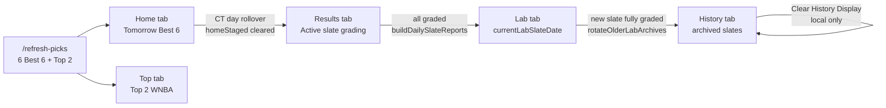
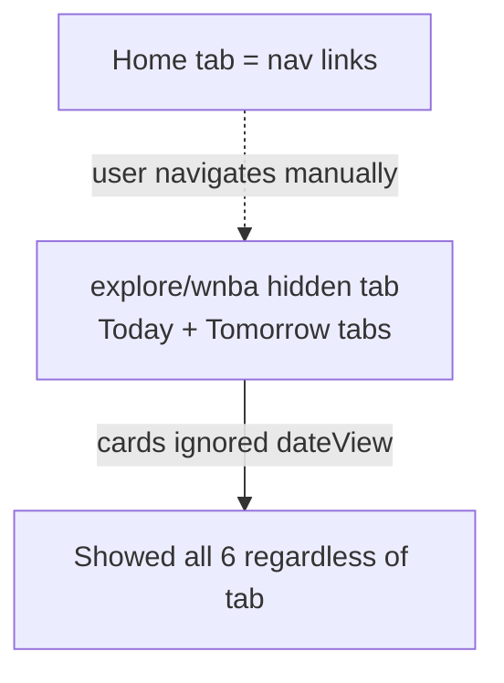

# CourtEdge Prop Rotation Flow Report

**Branch:** `betbrain-v2-rebuild`  
**Date:** 2026-06-26  
**SERVER_BUILD (unchanged):** `courteedge-best-six-display-fix-v1`  
**Latest commit:** _(see git log — fa212a1 rotation pass, then league-split pass)_

---

## Update: NBA + WNBA Separation (post fa212a1)

### How leagues were separated before

| Era | Home | NBA | WNBA |
|-----|------|-----|------|
| **Original (07f7a9d)** | Nav hub with separate **NBA Props** (`/nba`) and **WNBA Props** (`/wnba`) buttons | Full game board + Top props by day bucket (Today/Tomorrow) | Hidden explore route |
| **WNBA v2 (92e364a–fa212a1)** | WNBA-only Tomorrow Best 6 | Old board unchanged on `/nba` | Controlled Best 6 on explore |
| **Now** | **Dual-league Tomorrow Best 6** (WNBA + NBA sections) | Controlled Best 6 explore (`/nba`) | Controlled Best 6 explore (`/wnba`, `/explore`) |

Server already ran **parallel paths** via `selectControlledBestSixCombined`:
- `bestSixWNBA` / `bestSixDisplayWNBA` / `topWNBAProps`
- `bestSixNBA` / `bestSixDisplayNBA` / `topNBAProps`
- Shared slate rotation (date-based, not league-split) — both leagues on same slate date rotate together in Results/Lab/History

### Before / After UX

**Before (fa212a1):** Home showed WNBA Tomorrow Best 6 only; NBA still used legacy game-board screen without Controlled Best 6 display pool.

**After:** Home shows **two stacked sections** — WNBA Tomorrow Best 6 (pink) and NBA Tomorrow Best 6 (blue). Top tab already had separate NBA/WNBA blocks. `/nba` and `/wnba` routes use identical Controlled Best 6 explore screens with league-specific theming. Same rotation: Tomorrow Home → Results → Lab → History (user reset only).

### League-split files (this pass)

| File | Change |
|------|--------|
| `utils/controlledBestSixDisplay.js` | League-agnostic helpers: `buildLeagueBestSixBoard`, `resolveLeaguePicksPayload`, `buildLeagueControlledSummary`, `buildHomeControlledBestSixReportText` |
| `components/LeagueControlledBestSixScreen.tsx` | **New** — single-league explore/home screen |
| `components/HomeControlledBestSixScreen.tsx` | **New** — dual-league Tomorrow Home |
| `components/leagueBestSixTheme.ts` | **New** — NBA blue / WNBA pink themes |
| `app/(tabs)/index.tsx` | Uses `HomeControlledBestSixScreen` |
| `app/(tabs)/nba.tsx` | Controlled Best 6 explore (NBA) |
| `app/(tabs)/wnba.tsx` | Controlled Best 6 explore (WNBA) |
| `utils/reportBuilders.ts` | `buildLeagueControlledBestSixReport` |
| `betbrain-server/scripts/testControlledBestSixDisplay.js` | +tests 38–40 (NBA + home report) |

### Gaps

- **Rotation is slate-date scoped, not per-league:** When one league's 6 grade before the other on the same date, Lab promotion waits for full slate completion (existing server behavior).
- **NBA decision intelligence:** Uses same `propDecisionIntelligenceV1` pipeline as WNBA via controlled selector; WNBA-specific gate fields (`wnbaTrackingDecision`) fall back gracefully for NBA.
- **No SERVER_BUILD bump:** Client-only + shared util changes; server payloads already exposed NBA display fields.

---

## Executive Summary

CourtEdge already had a **server-side slate rotation engine** (`computeSlateRotation`, lifecycle classification, Lab promotion, History archival). The main gaps were **client UX**: Home was a navigation hub (not the Best 6 board), Best 6 cards ignored Today/Tomorrow date tabs, and History auto-expired after 7 days instead of staying until user reset.

This pass wires **Home → Tomorrow Best 6 only**, fixes **date-scoped Best 6 display**, and sets **History retention to user-reset-only**. Server rotation logic was verified and extended with one additional lifecycle test; no server code changes required.

---

## Desired Flow vs Current (After Fix)

| Step | Desired | Before | After |
|------|---------|--------|-------|
| 1. Generation | 6 props through full intelligence | ✅ `/refresh-picks` → controlled cohort + tracking | ✅ Unchanged |
| 2. Home | Tomorrow section only | ❌ Home was link dashboard; Best 6 on hidden explore tab with Today/Tomorrow tabs | ✅ Home tab shows **Tomorrow Best 6 only** |
| 3. Top tab | Top 2 from Best 6 | ✅ `selectControlledBestSix` → top 2 WNBA on refresh | ✅ Unchanged |
| 4. Day rollover | Tomorrow → Results | ✅ `homeStaged` on future slate; CT midnight clears `homeStaged` on auto-lock | ✅ Unchanged |
| 5. Grading → Lab | All 6 graded → Lab | ✅ `buildDailySlateReportsFromTrackedProps` → `promoteSlateToLab` + rotation inference | ✅ Unchanged |
| 6. Lab retention | Until next rotation | ✅ Newest completed = Lab; older in `historySlates` | ✅ Unchanged |
| 7. History | Prior Lab when new batch graded | ✅ `rotateOlderLabArchives` on report build | ✅ Unchanged |
| 8. History retention | Until user reset | ⚠️ 7-day auto-hide | ✅ **User Clear only** (`HISTORY_RETENTION_DAYS = 0`) |
| 9. Smooth rotation | End-to-end | ⚠️ UI date filter didn't scope cards | ✅ Date filter applied to cards + summary |

---

## Flow Diagrams

### Desired / Implemented Rotation



### Before (Home UX gap)



---

## Files Inspected

### Client — Tabs

| File | Role |
|------|------|
| `app/(tabs)/index.tsx` | Home tab (was nav hub) |
| `app/(tabs)/explore.tsx` | WNBA Controlled Best 6 (hidden route) |
| `app/(tabs)/top-props.tsx` | Top 2 NBA + WNBA |
| `app/(tabs)/results.tsx` | Active Results grading queue |
| `app/(tabs)/prop-lab.tsx` | Current Lab slate analytics |
| `app/(tabs)/history.tsx` | Archived slates + saved picks |
| `app/(tabs)/_layout.tsx` | Tab bar (Home, Top, Results, Lab, History) |

### Client — Utils

| File | Role |
|------|------|
| `utils/slateRotation.ts` | Client mirror of rotation (`computeSlateRotation`, `pickActiveResultsSlateDate`) |
| `utils/slateMessages.ts` | User-facing slate date messages |
| `utils/controlledBestSixDisplay.js` | Best 6 display helpers, date buckets |
| `utils/resultsQueue.ts` | Results visibility, active slate helpers |
| `utils/historyArchive.ts` | History entry builders |
| `utils/historyRetention.ts` | Local History clear + retention |
| `utils/groupByDayBucket.ts` | Today/Tomorrow game grouping |

### Server

| File | Role |
|------|------|
| `betbrain-server/services/slateScopeService.js` | Rotation source of truth |
| `betbrain-server/services/slateLifecycleService.js` | Per-prop lifecycle buckets (`HOME_STAGED`, `ACTIVE_RESULTS`, etc.) |
| `betbrain-server/services/trackedPropService.js` | Tracking admission, `homeStaged`, auto-lock |
| `betbrain-server/services/dailySlateReportService.js` | Report build, Lab promotion, `rotateOlderLabArchives` |
| `betbrain-server/services/slateLockService.js` | Lock/Lab/Archive phases |
| `betbrain-server/services/topPicksSnapshotService.js` | Top 2 snapshots |
| `betbrain-server/server.js` | `/picks`, `/tracked-props`, `/daily-slate-reports` |

### Tests / Scripts

| File | Role |
|------|------|
| `betbrain-server/scripts/testSlateRotationLifecycle.js` | Rotation unit tests (24 cases) |
| `betbrain-server/scripts/testControlledBestSixDisplay.js` | Display helper tests (37 cases) |
| `betbrain-server/scripts/testActiveResultsSlate.js` | Results admission |
| `betbrain-server/scripts/testTrackedPropsLifecycleFilter.js` | Lifecycle filter |

---

## How Rotation Works Today

### 1. Generation (`POST /refresh-picks`)

- Builds today + tomorrow game cards with `dayBucket` / `dateLabel`.
- `selectControlledBestSix` picks 6 WNBA (+ NBA) through decision intelligence.
- Top 2 WNBA from Best 6 → `topWNBAProps` + snapshot.
- TRACK-only cohort → `addTrackedProps` (future slate props get `homeStaged: true` when prior Results slate still open).

### 2. Home (Tomorrow board)

- Reads `/picks` cache (`bestSixDisplayWNBA`, `bestSixWNBA`, `topWNBAProps`).
- **Home tab** filters display pool to `dayBucket === TOMORROW` only.
- Does **not** show tracked props — board is pre-admission preview.

### 3. Top tab

- `/top-props` returns snapshotted top 2 per league from last refresh.

### 4. Day rollover → Results

- When slate date becomes today and official TRACK props exist:
  - `pickActiveResultsSlateDate` → today.
  - `autoLockResultsSlateIfReady` locks slate, clears `homeStaged` on today's props.
- `/tracked-props` default response = `activeResultsProps` only (TRACK official, not homeStaged).

### 5. Grading completion → Lab

- `POST /resolve-tracked-props` grades props.
- `buildDailySlateReportsFromTrackedProps`:
  - Final report → `promoteSlateToLab` + history archive (`phase: LAB`).
  - `rotateOlderLabArchives` → older finals get `phase: ARCHIVED`.
- Client `computeSlateRotation` also **infers** Lab from graded props when report is stale.

### 6. Lab tab

- Uses `currentLabSlateDate` from `/daily-slate-reports` rotation metadata.
- Shows report sections + tracked prop analytics for that slate.

### 7. History tab

- `buildHistoryEntries` + rotation `historySlates` / archives with `phase: ARCHIVED`.
- **Clear History Display** → AsyncStorage hide (backend unchanged).
- **No auto 7-day expiry** after this fix.

---

## Changes Made (This Pass)

| File | Change |
|------|--------|
| `components/WnbaControlledBestSixScreen.tsx` | **New** shared Home/Explore board; Home = Tomorrow-only |
| `app/(tabs)/index.tsx` | Home uses shared screen `variant="home"` |
| `app/(tabs)/explore.tsx` | Thin wrapper `variant="explore"` |
| `utils/controlledBestSixDisplay.js` | `HOME_DATE_VIEW`; date-scoped `controlledBestSixTotal`; card date filter support |
| `utils/historyRetention.ts` | `HISTORY_RETENTION_DAYS = 0` (no auto expiry) |
| `app/(tabs)/history.tsx` | Copy updated for user-reset-only retention |
| `betbrain-server/scripts/testSlateRotationLifecycle.js` | +test 24; header count |
| `betbrain-server/scripts/testControlledBestSixDisplay.js` | +tests 36–37; fix tests 14/34 for scoped totals |

---

## Remains Manual / TBD

| Item | Notes |
|------|-------|
| **Prod runtime repair** | If prod JSON still has stale reports / wrong archive phases, run repair scripts with `ADMIN_SECRET` (see `COURTEDGE_SLATE_ROTATION_FIX_REPORT.md`) |
| **`/refresh-picks` on schedule** | Tomorrow props appear on Home only after refresh generates them |
| **Scout / Full Board** | Hidden on Home; still on explore route (`/explore`, `/wnba`) |
| **NBA Best 6 on Home** | ~~Home is WNBA-only~~ **Fixed** — dual WNBA + NBA Tomorrow sections |
| **Saved picks in History** | User-saved picks still appear alongside archived Lab slates |

---

## Test Results

```
node betbrain-server/scripts/testSlateRotationLifecycle.js     → 24 passed, 0 failed
node betbrain-server/scripts/testControlledBestSixDisplay.js   → 40 passed, 0 failed
```

---

## Blockers

- **ADMIN_SECRET**: Required for prod repair endpoints; not needed for this client-only deploy.
- **Prod JSON state**: Code deploy alone does not rebuild stale daily reports or re-archive slates — use existing repair scripts if prod Lab/History is stuck.
- **No `/clear-tracked-props`**: Not run (per instructions).

---

## Controlled Best 6 / TRACK Separation

Preserved:

- Display Best 6 (`bestSixDisplayWNBA`) can show all 6 board ranks.
- Results admission remains TRACK-only (`controlledBestSixTrack` in summary).
- `/tracked-props` lifecycle filter unchanged on server.
